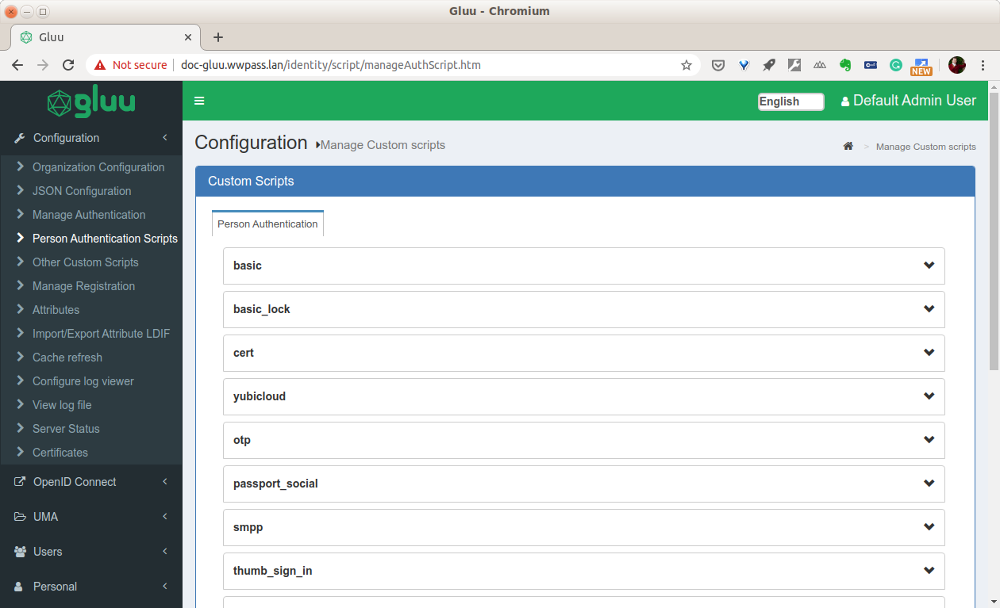
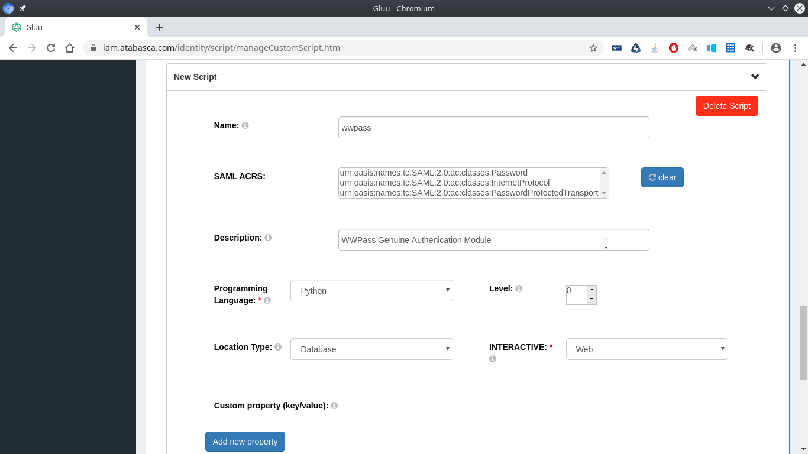

# Setting Up WWPass Authentication in Gluu Server

## Introduction

[WWPass](https://wwpass.com/) replaces the traditional username and password
login with a more advanced multi-factor authentication solution. WWPass employs
strong cryptography and robust combination of authentication factors to deliver
a secure and user-friendly authentication experience. WWPass authentication
starts with a smartphone app or a hardware token as the first authentication
factor. Then additional authentication factors such as PIN or biometrics can be
added to verify the user identity further.

Combining WWPass strong multi-factor authentication with the versatility of
Gluu Server helps to build secure IAM solutions that can be used for single
sign-on (SSO), customer identity and access management (CIAM), and identity
federation.

## Prerequisites

This tutorial assumes that you have the following:

- Gluu Server 4.2 installed on Ubuntu Server 20.04 or 18.04;
- An administrative account on this Ubuntu Server;
- WWPass Key app or hardware token;

### Obtain Application Certificate and Private Key From WWPass

To obtain an application certificate and private key go to
[wwpass.com](https://wwpass.com), click **Sign Up** to create a developer
account or **Log In** if you already have an account. Then follow the website
instructions to register your application domain and issue the application
certificate.

## Prepare WWPass Integration Files

Download WWPass integration files from GitHub
[https://github.com/wwpass/gluu/archive/master.zip](https://github.com/wwpass/gluu/archive/master.zip).

Extract the files

```console
unzip master.zip
```

Go to the “gluu-master” directory (`cd gluu-master`) and copy files
and directories as follows:

Note, some of the files are relative symlinks. When deploying make sure to copy
directory content, not the symlinks themselves. Also make sure all file and
directory operations are performed outside the Gluu container.

Files in `oxauth` directory should be deployed to
`/opt/gluu-server/opt/gluu/jetty/oxauth/custom/`

```console
sudo cp -rL oxauth/* /opt/gluu-server/opt/gluu/jetty/oxauth/custom/
```

Files in `oxtrust` directory should be deployed to
`/opt/gluu-server/opt/gluu/jetty/identity/custom/`

```console
sudo cp -rL oxtrust/* /opt/gluu-server/opt/gluu/jetty/identity/custom/
```

Files in `idp` directory should be deployed to
`/opt/gluu-server/opt/gluu/jetty/idp/custom/` if you have installed Shibboleth IDP

```console
sudo cp -rL idp/* /opt/gluu-server/opt/gluu/jetty/idp/custom/
```

Copy `wwpass.py` to `/opt/gluu-server/opt/gluu/python/libs/`

```console
sudo cp wwpass.py /opt/gluu-server/opt/gluu/python/libs/
```

Copy `ticket.json` to `/opt/gluu-server/opt/wwpass_gluu/cgi`

``` console
sudo mkdir -p /opt/gluu-server/opt/wwpass_gluu/cgi
sudo cp ticket.json /opt/gluu-server/opt/wwpass_gluu/cgi
```

Make sure `ticket.json` is executable

```console
sudo chmod 755 /opt/gluu-server/opt/wwpass_gluu/cgi/ticket.json
```

Copy WWPass application certificate and private key to
`/opt/gluu-server/opt/wwpass_gluu/`
(assuming the certificate and key files are in your home directory)

```console
sudo cp ~/gluu_client.crt /opt/gluu-server/opt/wwpass_gluu/gluu_client.crt
sudo cp ~/gluu_client.key /opt/gluu-server/opt/wwpass_gluu/gluu_client.key
```

Replace `~/gluu_client.crt` and `~/gluu_client.key` with the names and location
of your certificate and key files.

Copy WWPass CA certificate `wwpass.ca.crt` to `/opt/gluu-server/opt/wwpass_gluu/`

```console
sudo cp wwpass.ca.crt /opt/gluu-server/opt/wwpass_gluu
```

Log in to the Gluu Server container

```console
sudo /sbin/gluu-serverd login
```

Change ownership of files and directories just copied

```console
chown -R jetty:jetty /opt/jetty
chown root:gluu /opt/gluu/python/libs/wwpass.py
```

## Configure Apache

Use your favorite console text editor to change Apache configuration

```console
[vi|nano|joe|...] /etc/apache2/sites-available/https_gluu.conf
```

Scroll down the file until you find the last `<Location>...</Location>` tag and
insert the following snippet below it:

```apache
<Location /wwpass>
  require all granted
</Location>

ScriptAlias "/wwpass/" "/opt/wwpass_gluu/cgi/"

<Directory /opt/wwpass_gluu/cgi/>
  SetHandler cgi-script
  Options +ExecCGI
  Order deny,allow
  Allow from all
</Directory>
```

Save the file and exit the editor.

Enable mod_cgi and restart apache:

```console
a2enmod cgi
systemctl restart apache2
```

Check that `ticket.json` is working.
Go to `https://<your_gluu_host>/wwpass/ticket.json`.
If your setup is correct, you will see output like this:

```json
{"result": true, "data": "SPNAME:07629a1963c5e4f4f339ecb852b7a0bf10a90c62@p-sp-05-50:16033", "ttl": 600, "encoding": "plain"}
```

## Configure Gluu Server

Log in as administrator and go to "Configuration -> Person Authentication Scripts".


In `Person Authentication` tab, click `Add custom script configuration` at the bottom of the page


Create custom script `wwpass` with Location Type set to `Database`.


Add the following to `Custom Property` fields by clicking on `Add new property` button:

- wwpass_crt_file: /opt/wwpass_gluu/gluu_client.crt
- wwpass_key_file: /opt/wwpass_gluu/gluu_client.key
- registration_url: URL of the registration web application, if you have one. Do not add this property otherwise
- recovery_url: URL for account recovery, if you have one. Do not add this property otherwise.

To require PIN or biometrics during login, add:

- use_pin: True

To enable binding WWPass keys with email, add:

- allow_email_bind: True

Note, your Gluu server should be able to send emails, see
`Configuration -> Organization configuration -> SMTP Server Configuration`.

To enable binding WWPass keys with existing usernames and passwords, add:

- allow_password_bind: True

To enable binding WWPass keys with another WWPass key, add:

- allow_passkey_bind: True


Replace the content of `Script` textbox with the content of `wwpassauth.py` from `gluu-master`

Set `Enabled` checkbox to enable the custom script:


Click the `Update` button.

It's also recommended to increase the unauthenticated session lifetime to give
users more time to bind their WWPass keys.

Go to `Configuration -> JSON configuration -> OxAuth Configuration`, find
`sessionIdUnauthenticatedUnusedLifetime` setting and set it to `600` or more.


Click `Save Configuration` to save settings.

### Set up Authentication Method

Before switching to WWPass authentication, make sure you have opened
an administrator session in a different browser (not in a different window,
but a completely different browser). Do not close that browser window and
reload it from time to time to make sure your session does not expire.

Keep the backup session opened until you are sure that WWPass authentication
works properly or you might lock yourself out of Gluu. If that happens, refer to:
[Gluu FAQ](https://gluu.org/docs/gluu-server/operation/faq/#revert-an-authentication-method)

In the Gluu Admin interface, navigate to `Configuration -> Manage Authentication -> Default Authentication Method`.
Set both options to "wwpass".


Click `Update` to save settings.

### Test Your Setup

Open "https://<your.gluu.url>/" in a different browser (not the one you used to
configure Gluu).

Try to sign in to your Gluu server with WWPass and bind your key using either
email or username and password.

If something does not work as expected, return to your main browser and revert
`Configuration -> Manage Authentication -> Default Authentication Method` back
to `simple_password_auth` while you troubleshoot the problem.

## Troubleshooting

Relevant Gluu log files are:

- `/opt/gluu-server/opt/gluu/jetty/oxauth/logs/oxauth.log`
- `/opt/gluu-server/opt/gluu/jetty/oxauth/logs/oxauth_script.log`

Check the files above for any errors. Errors in `wwpass` interception script
are also displayed in Gluu web interface at 'Configuration -> Manage Custom
scripts'. If there are any errors in the script, its name will be in red and
the script editor will display the red button named "Show Error".

Feel free to contact WWPass at support@wwpass.com if you have troubles
integrating WWPass in your Gluu Server.
