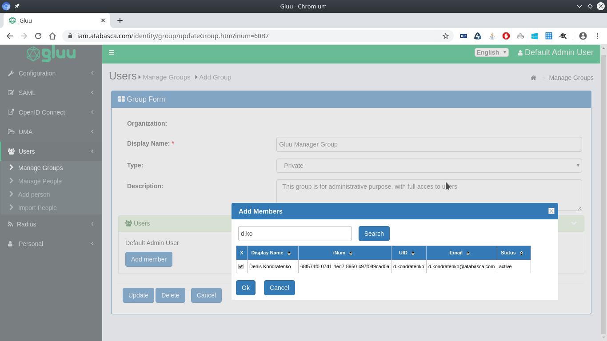
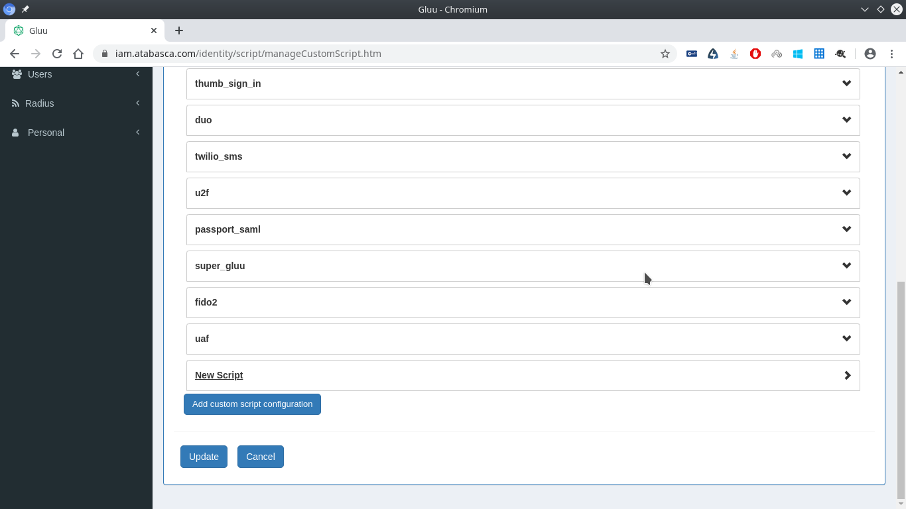
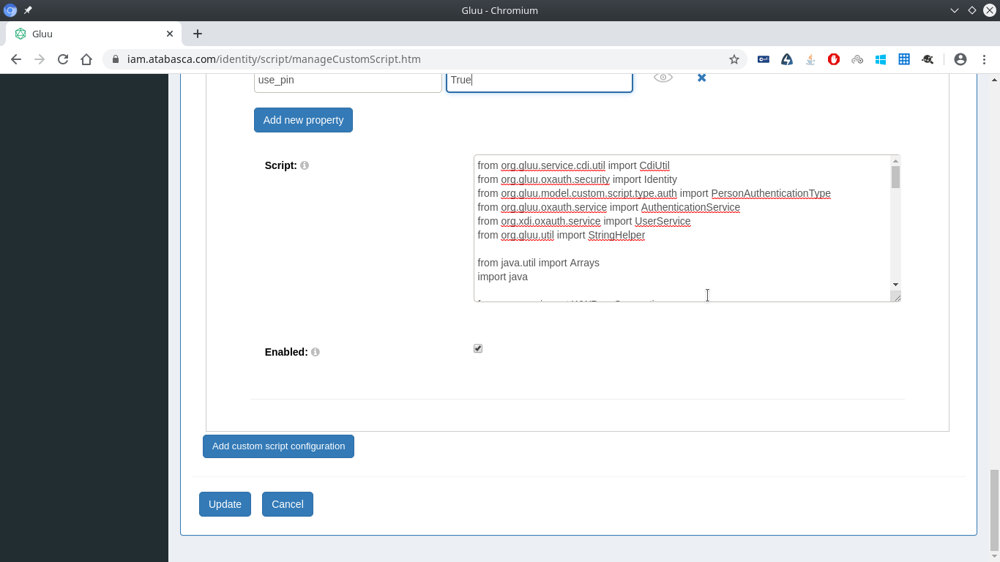

# Enabling WWPass authentication in Gluu

## Introduction

[WWPass technology](https://wwpass.com/) provides easy and secure way to authenticate users in any environment. It replaces traditional approach with usernames and passwords with more secure easy-to-use authentication mechanisms, based on strong cryptography using hardware tokens or smartphone apps. [Gluu](https://gluu.org) is an access management system that combines LDAP, OpenID Connect, RADIUS and other technologies to allow single sign on with multiple applications. Combining strong WWPass authentication with versatility of Gluu allows one to have various application to authenticate users securely with standard protocols like OpenID Connect.

## Prerequisites

This tutorial assumes that you have:
- Running Gluu server v. 4.1.1 on Ubuntu server
- Administative account on that server
- A client certificate and a private key file for WWPass
- WWPass Key as a moblie app or hardware token
- Basic knowledge of HTML and CSS

### Obtaining client certificate and private key file from WWPass
To obtain certificate and private key visit [wwpass.com](https://wwpass.com) if you already have WWPass account, sign in with WWPass Application and follow the instructions there. If you are not WWPass user follow the instriction to Sign Up on [wwpass.com](https://wwpass.com)

### Installing Gluu
To install Gluu server follow the [https://gluu.org/docs/gluu-server/installation-guide/install-ubuntu/](instructions at Gluu website):

It's very difficult to change Gluu FQDN after the setup, so decide on it before proceeding with the setup.

Please write down carefully (in [PassHub](https://passhub.net) or similar secure password manager) the password for LDAP Admin and oxTrust Admin Password (in case they are different)

If you forget or loose them, it would be very hard to recover them.

During gluu setup process (.\setup.py), please select “Yes” to install
- memcached
- oxAuth OAuth2
- oxTrust Admin UI
- Apache HTTPD Server
- Shibboleth SAML IDP
- Gluu Radius

Review the configuration settings and press “Yes”
Configuration settings should look like:
```
hostname                                          iam.example.com
orgName                                               Example inc.
os                                                         ubuntu
city                                                       Nashua
state                                                          NH
countryCode                                                    US
Applications max ram                                         3072
Install oxAuth                                               True
Install oxTrust                                              True
Backends                                                   wrends
Java Type                                                     jre
Install Apache 2 web server                                  True
Install Shibboleth SAML IDP                                  True
Install oxAuth RP                                           False
Install Passport                                            False
Install Casa                                                False
Install Oxd                                                 False
Install Gluu Radius                                          True
```

### Importing users to Gluu
If you have any account management infrastructure (i.e. Active Directory, OpenLDAP, eDirectory) make sure you provide a connectivity between Gluu and your LDAP directory. To import users to your Gluu server, refer to [Gluu instuction video 1](https://www.gluu.org/gluu-server-cache-refresh-configuration-part-1/), [2](https://www.gluu.org/gluu-server-cache-refresh-configuration-part-2/), [3](https://www.gluu.org/gluu-server-cache-refresh-configuration-part-3/).

Alternatively there are instuctions on Gluu website:  [LDAP sync](https://gluu.org/docs/gluu-server/user-management/ldap-sync/), [LDAP authentication](https://gluu.org/docs/gluu-server/authn-guide/basic/)

If you don’t have any account management infrastructure or plan to use local Gluu accounts, please create all users and groups you need at this step before WWPass integration. Refer to: [Gluu documentation](https://gluu.org/docs/gluu-server/user-management/local-user-management/#manage-people)

It is good idea to create your own account and add it in Gluu Manager group. See: [Group management](https://gluu.org/docs/gluu-server/user-management/local-user-management/#manage-groups-in-oxtrust)



### Gluu container

Gluu server runs in a container located at `/opt/gluu-server/`. To enter a shell inside the container use
`sudo gluu-serverd login`

To check if you are inside container run
`systemd-detect-virt -c`

If you are inside Gluu container the out put will be “systemd-nspawn”

To exit from Gluu container run `exit` command.

If you are outside the Gluu container – the output is “none”.

### Updating Gluu to 4.1.1
If you are running 4.x.x version of Gluu you should update to 4.1.1 (this is the latest release at the time of writing). Previus versions contain several bugs that prevent smooth integration with many SAML SPs.

First download updated files:
- https://ox.gluu.org/maven/org/gluu/oxtrust-server/4.1.1.Final/oxtrust-server-4.1.1.Final.war
- https://ox.gluu.org/maven/org/gluu/oxshibbolethIdp/4.1.1.Final/oxshibbolethIdp-4.1.1.Final.war
- https://ox.gluu.org/maven/org/gluu/oxauth-server/4.1.1.Final/oxauth-server-4.1.1.Final.war

Stop services:

```
$ sudo /sbin/gluu-serverd stop
```

Backup current application files and install new files:
```
$ sudo mv /opt/gluu-server/opt/gluu/jetty/identity/webapps/identity.war identity.war-4.1.0
$ sudo cp oxtrust-server-4.1.1.Final.war /opt/gluu-server/opt/gluu/jetty/identity/webapps/identity.war

$ sudo mv /opt/gluu-server/opt/gluu/jetty/idp/webapps/idp.war idp.war-4.1.0
$ sudo cp oxshibbolethIdp-4.1.1.Final.war /opt/gluu-server/opt/gluu/jetty/idp/webapps/idp.war

$ sudo mv /opt/gluu-server/opt/gluu/jetty/oxauth/webapps/oxauth.war oxauth.war-4.1.0
$ sudo cp oxauth-server-4.1.1.Final.war /opt/gluu-server/opt/gluu/jetty/oxauth/webapps/oxauth.war
```

Start gluu-server:
```
$ sudo /sbin/gluu-serverd start
```

## Preparing the files

Download the pages and scripts from Github [https://gitlab.wwpass.net/demo-projects/gluu/-/archive/master/gluu-master.tar.gz](https://gitlab.wwpass.net/demo-projects/gluu/-/archive/master/gluu-master.tar.gz):

Extract the files:
```
$ tar xvzf gluu-master.tar.gz
```

Go to the created “gluu-master” directory (`cd gluu-master`) and copy files and directories as follows:
NB. Some of the files are relative symlinks. When deploying make sure to copy directory contents, but not the symlinks themselves.
NB. All files and directories operations should be done from outside the container

Files in `oxauth` directory should be deployed to: "/opt/gluu-server/opt/gluu/jetty/oxauth/custom/".
```
$ sudo cp -rL oxauth/* /opt/gluu-server/opt/gluu/jetty/oxauth/custom/
```

Files in `oxtrust` directory should be deployed to: "/opt/gluu-server/opt/gluu/jetty/identity/custom/".
```
$ sudo cp -rL oxtrust/* /opt/gluu-server/opt/gluu/jetty/identity/custom/
```

Files in `idp` directory should be deployed to: "/opt/gluu-server/opt/gluu/jetty/idp/custom/".
```
$ sudo cp -rL idp/* /opt/gluu-server/opt/gluu/jetty/idp/custom/.
```

Copy `wwpass.py` to: "/opt/gluu-server/opt/gluu/python/libs/".
```
$ sudo cp wwpass.py /opt/gluu-server/opt/gluu/python/libs/
```

Copy `ticket.json` to: "/opt/gluu-server/opt/wwpass_gluu/cgi".
```
$ sudo mkdir -p /opt/gluu-server/opt/wwpass_gluu/cgi
$ sudo cp ticket.json /opt/gluu-server/opt/wwpass_gluu/cgi
```

Make sure this file is executable:
```
$ sudo chmod 755 /opt/gluu-server/opt/wwpass_gluu/cgi/ticket.json
```

WWPass client certificate and private key (from prerequisites) to "/opt/gluu-server/opt/wwpass_gluu/" assuming certificate and key are in your home directory:
```
$ sudo cp ~/gluu_client.crt /opt/gluu-server/opt/wwpass_gluu/gluu_client.crt
$ sudo cp ~/gluu_client.key /opt/gluu-server/opt/wwpass_gluu/gluu_client.key
```

WWPass CA certificate `wwpass.ca.crt` to "/opt/gluu-server/opt/wwpass_gluu/":
```
$ sudo cp wwpass.ca.crt /opt/gluu-server/opt/wwpass_gluu
```

Login to gluu container with:
```
$ sudo /sbin/gluu-serverd login
```

Change ownership of files and directories just copied:
```
    chown -R jetty:jetty /opt/jetty
    chown root:gluu /opt/gluu/python/libs/wwpass.py
```

Now all the files are ready, we have to make the server use them!

## Configuring the apache server
Inside the Gluu container use your favorite console editor to change Apache configuration:
```
# <vi|nano|joe|...> /opt/gluu-server/etc/apache2/sites-available/https_gluu.conf
```

Scroll down the file until you find the last `<Location>...</Location>` tag, insert the following snippet after it:
```
<Location /wwpass>
  require all granted
</Location>

ScriptAlias "/wwpass/" "/opt/wwpass_gluu/cgi/"

<Directory /opt/wwpass_gluu/cgi/>
  SetHandler cgi-script
  Options +ExecCGI
  Order deny,allow
  Allow from all
</Directory>
```

Save the file and exit the editor.

Enable apache module cgi and restart it:
```
# a2enmod cgi
# systemctl restart apache2
```

Check that `ticket.json` is working. Go to "https://<your_gluu_host>/wwpass/ticket.json". If your setup is correct you'll see something like that:
```
{"result": true, "data": "SPNAME:07629a1963c5e4f4f339ecb852b7a0bf10a90c62@p-sp-05-50:16033", "ttl": 600, "encoding": "plain"}
```

## Gluu server configuration
Finally it's time to configure the Gluu server. Login as administrator and go to "Configuration -> Manage Custom scripts"


Under "Person Authentication" tab, click "Add custom script configuration" at the bottom of the screen


Create custom script `wwpass` with Location Type "Database".


Add the following to “Custom Property” fields by clicking on “Add new property” button:
 - wwpass_crt_file: /opt/wwpass_gluu/gluu_client.crt
 - wwpass_key_file: /opt/wwpass_gluu/gluu_client.key
 - registration_url: URL of registration web application, if you have one. Do not add this property otherwise.
 - recovery_url: URL for account recovery, if you have one. Do not add this property otherwise.

To require PIN to log in:
 - use_pin : True

To enable binding WWPass PassKey to an account using email (Gluu sever should be configured to send emails, "Configuration -> Organization configuration -> SMTP Server Configuration" in Gluu Admin web interface):
 - allow_email_bind: True

To enable binding WWPass PassKey to an account using username and password:
 - allow_password_bind: True

To enable binding WWPass PassKey to an account using another PassKey:
 - allow_passkey_bind: True


Paste with replacing the content of “wwpassauth.py” from downloaded "gluu-master" to "Script" textbox.

Don't forget to enable the custom script with “Enabled” checkbox:


Click “Update” button.

It's also recommended to increase unauthenticated session lifetime to give users more time to bind their WWPass keys.

Go to "Configuration -> JSON configuration -> OxAuth Configuration", find setting named "sessionIdUnauthenticatedUnusedLifetime" and set it to `600` or more.


Click "Update" to save the settings.

### Setup authentication method

Before switching to WWPass authentication make sure you have administrator session in a different browser (not in a different window, but in a completely different browser).

Don't close this browser window and open it sometimes to make sure that your session is not expired.

Keep it open until you are sure that WWPass authentication is working, or you might lock yourself out of Gluu. If that happens, refer to:
[Gluu FAQ](https://gluu.org/docs/gluu-server/operation/faq/#revert-an-authentication-method)

In Gluu Admin interface navigate to: "Configuration -> Manage Authentication -> Default Authentication Method"
Set both options to "wwpass".


### Test the setup

Open "https://<your.gluu.url>/" in a different broswer, not the one you used to configure it.

Try to sign in to your Gluu server with WWPass and bind your account using either email or username and password.

If something doesn't work as expected, return to your main mrowser and revert "Configuration -> Manage Authentication -> Default Authentication Method" back to "auth_ldap_server" while you are trobleshooting the problem.

## Troubleshooting

Relevant Gluu log files are:
 - `/opt/gluu-server/opt/gluu/jetty/oxauth/logs/oxauth.log`
 - `/opt/gluu-server/opt/gluu/jetty/oxauth/logs/oxauth_script.log`

 Check them for any errors. Erros in `wwpass` interception script are also displayed in Gluu web interface at "Configuration -> Manage Custom scripts". If there are any errors in the script, it's name will be red and in script editing for there will be a red button "Show Error".

 Feel free to contact WWPass at support@wwpass.com if you have trouble integrating WWPass in your Gluu setup


